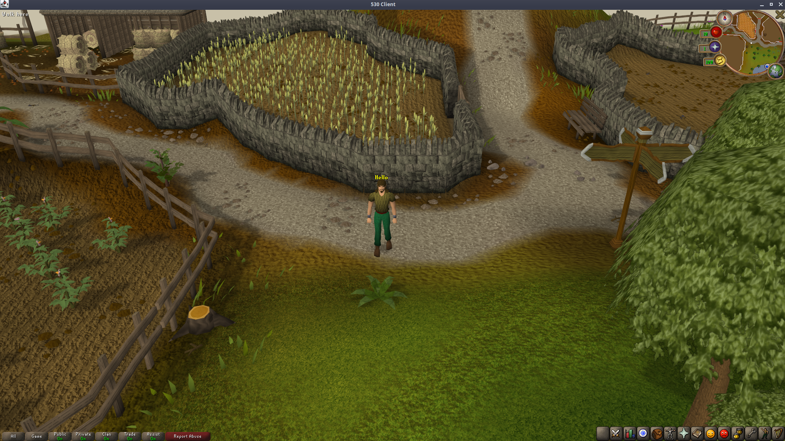

# Arios-530

Arios 530 with various fixes and improvements.

List of some improvements (there are more, these are just some of the main ones):

* Updated server to support MySQL 8
* Updated server to support Java 17
* Updated client to support Java 17
* Updated various server libraries
* Updated client to latest JOGL 2.4.0 from JOGL 1: this fixes many HD issues including random crashing on Linux when maximizing, and should in theory improve Mac support as well.
* Increased render distance
* Properly render fog at all distances
* Added middle mouse camera movement
* Added spacebar to skip chat and 1-5 keyboard dialogue option picking
* Fixed banker dialogue chat option bug
* Fixed world map not opening
* Added ESC to close interface and TAB to reply
* Added shift scroll zooming
* Fixed collapsible sidestones
* Fixed loading SQL settings table
* Rewrote SQL password loading
* Removed unnecessary files 

# Install

To run the server, open the "Arios-Server" folder in one IntelliJ window, then start the Management Server run profile, then start the Server run profile, then start the Client run profile.
